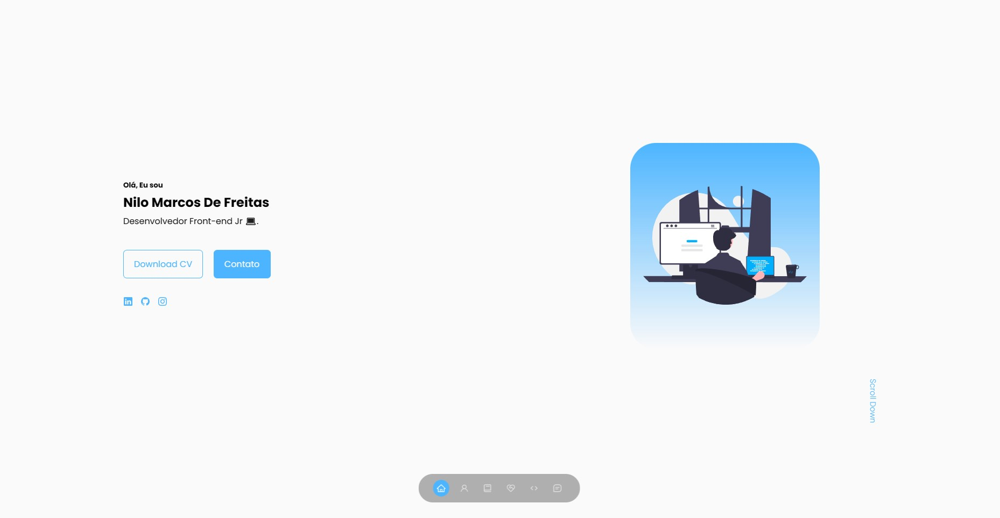
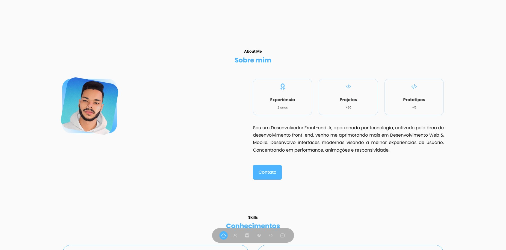
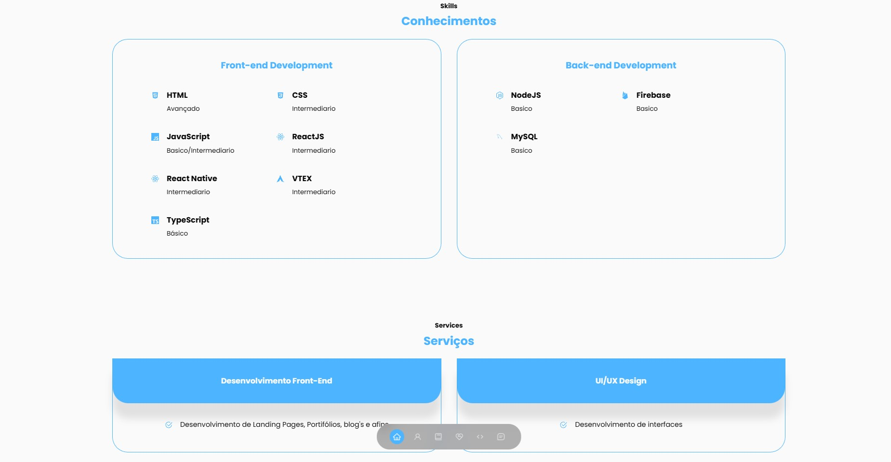
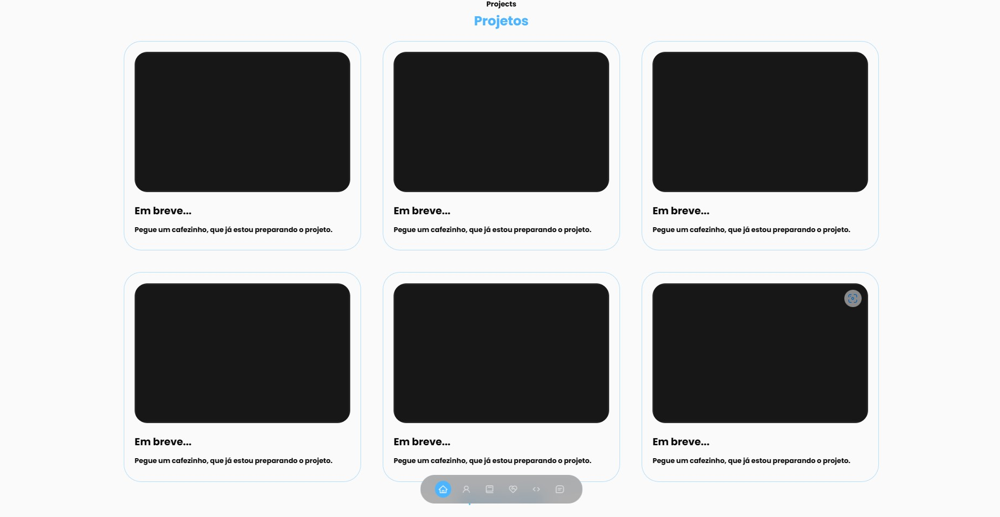
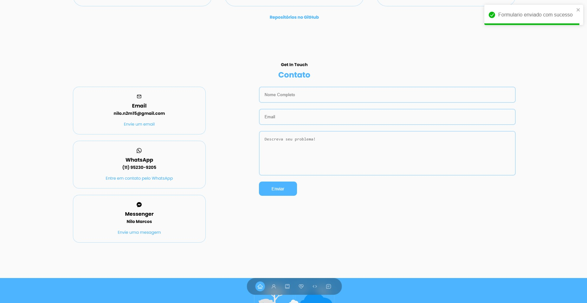

<h1 align="center">Meu portifolio</h1>

<!-- Getting Started -->
# Sobre a aplicação
Criei meu portifolio para praticar meus conhecimentos com ReactJS, utilizei bastante animação e libs para deixar o site muito mais legal, onde tem interações entre o usuario e o sistema.

### INICIANDO O PROJETO

Para instalar o projeto em sua maquina siga os passos abaixo.

### INSTALAÇÃO
1. Clone o repositório

   ```sh
   git clone https://github.com/NiloMarcos/Portifolio-ReactJS.git
   ```

2. Entre na pasta

   ```sh
   cd Portifolio-ReactJS
   ```

3. Instale as dependências

   ```sh
   yarn
   ```

   ou

   ```sh
   npm i

### Iniciar a aplicação
1. Abra o terminal e rode a aplicação com
   ```sh
   yarn start
   ```

### Apresentação da aplicação
<p align="center">

<div>
  
  
  
  
  
</div>